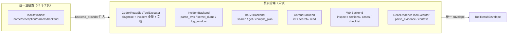

# 统一工具注册表：全量工具化说明

> 状态：已实现；更新时间：2026-08-05
> 范围：把 debug_agent_system 全部只读能力（读侧、Incident、KG、语料、写侧只读面）统一注册为 Agent 可调用的工具，供 Codex / DeepSeek / 未来 MCP 使用。
> 入口代码：`src/debug_agent_system/agents/tools/registry.py`、`registry_backends.py`

---

## 1. 为什么需要统一注册表

改造前，工具 schema 散落在三处，风格不一致：

| 位置 | 工具数 | 风格 | 服务对象 |
|---|---|---|---|
| `kg_raw_codex/pipeline.py CorpusReadTools.schemas()` | 3 | Responses 风格 | Codex / DeepSeek 旁路 |
| `read_runtime_v3/providers.py ReadToolRegistry.schemas()` | 8 | Responses 风格 | v3/v4 planner |
| `adapters/codex_read/executor.py read_side_tool_schemas()` | 32 | Chat Completions 风格 | Codex 专用 |
| `adapters/deepseek_read/executor.py` | 4 | Chat Completions 风格 | DeepSeek 专用 |

统一注册表把这四份合并为**单一事实源**，并：
- 统一工具命名、description、参数 schema；
- 同时输出 **Responses**（Codex）与 **Chat Completions**（DeepSeek）两种风格；
- 复用现有执行器（`CodexReadSideToolExecutor`、`IncidentEvidenceRuntime`、`CorpusReadTools`、W9）作为后端，不重复实现；
- 每个执行结果统一包装为 `debug_agent_system.read_tool_result.v1` envelope，带 evidence_ids / safety / observability。

---

## 2. 全量工具清单（45 个）

### 2.1 evidence（2）

| 工具 | 说明 |
|---|---|
| `parse_evidence` | 有界只读解析一个证据资源（附件/文档/转储/图片/Jira/日志包/工程文件） |
| `parse_evidence_context` | 读取样本目录 / source_manifest 批量路由解析 |

### 2.2 incident（26）

| 工具 | 说明 |
|---|---|
| `analyze_incident` | 创建不可变 Incident 快照，解析工件、查 KG 假设、构建验证报告 |
| `index_log_package` | 显式诊断包摄取入口（case_id/工件数/事件数） |
| `parse_incident_scope` | 把 query/Jira 参考时间规范化为本地时间窗 |
| `parse_evtx_window` | 解析 EVTX 并按参考时间窗对齐 |
| `read_kernel_dump` | 只读解析 Minidump/PAGEDU64 内核转储头（bugcheck code/参数/OS） |
| `read_log_window` | 读取日志在指定行号附近的上下文窗口 |
| `search_diagnostic_events` | 在已解析案件中按关键字搜索诊断事件 |
| `search_diagnostic_events_by_time` | 按 ISO 时间区间在已抽取事件中搜索 |
| `build_incident_timeline` | 按时间排序生成时间线 |
| `get_jira_snapshot` | 读取不可变 Jira/案件快照 |
| `get_incident_scope` | 读取规范化 query 时间 scope |
| `get_incident_evidence_pack` | 返回 Incident Evidence Pack v3 |
| `list_artifacts` | 工件列表（含 hash 与解析状态） |
| `inspect_archive_manifest` | 压缩包祖先与成员检查（不执行/不解压到调用方路径） |
| `extract_log_time_windows` | 返回按时间 scope 流式抽取的日志窗口 |
| `inspect_stacktrace` | 栈帧检查（保留检测点 vs 根因边界） |
| `inspect_environment` | 软件/驱动/OS/硬件版本观察 |
| `inspect_evtx` | 选定 EVTX 工件的来源绑定记录（含时间对齐） |
| `inspect_dump` | 有界 minidump 进程/异常/OS/模块元数据 |
| `query_kg_hypotheses` | 返回 KG_v2 候选假设矩阵 |
| `retrieve_similar_cases` | 返回相似 SourceCase（非权威线索） |
| `propose_next_tests` | 返回按信息增益排序的安全下一步测试 |
| `plan_reproduction` | 构建不执行的受控复现计划 |
| `compare_reproduction_runs` | 比较两个 incident run 的重复签名 |
| `compare_incident_environments` | 比较两个环境快照 |
| `render_incident_report` | 返回本地验证的 Jira 友好报告 |

### 2.3 diagnose（7）

| 工具 | 说明 |
|---|---|
| `diagnose_start` | 启动确定性 KG_v2 诊断运行时（唯一可锁 Variant） |
| `diagnose_step` | 推进已有诊断会话 |
| `retrieve_evidence` | 双 SAG 通道召回 FaultVariant 候选与 chunk |
| `expand_document_context` | 展开选中文档的完整语义大纲 |
| `inspect_kg_path` | 查看 Family/Variant 诊断路径（不选分支） |
| `inspect_source_assets` | 列文档 chunk 绑定图片/附件 |
| `render_evidence_answer` | 提交来源闭合答案计划（verifier 校验后渲染） |

### 2.4 kg（3）

| 工具 | 说明 |
|---|---|
| `kg_search_candidates` | 检索 KG_v2/SAG 故障候选 |
| `kg_get_object` | 按 id 读取单个规范 KG_v2 对象 |
| `kg_compile_plan` | 编译 family+variant 为 V2DiagnosticPlan |

### 2.5 corpus（3）

| 工具 | 说明 |
|---|---|
| `list_files` | 按相对 glob 列语料文件 |
| `search_text` | 语料文本/正则搜索（无相关性评分） |
| `read_text` | 读取语料文本文件精确行区间 |

### 2.6 write（4）——写侧只读面

| 工具 | 说明 |
|---|---|
| `w9_inspect_document` | 检查原始知识文档并决定处理策略（doc_strategy）与推荐步骤 |
| `w9_build_structured_sections` | 把文档解析为结构化语义分块 |
| `w9_build_section_cases` | 章节 → section-case + chunk_manifest（approved=false） |
| `w9_build_root_checklist` | 扫描根目录生成处理清单 |

> **刻意排除**（安全边界）：`apply_approved`、`mark_decision`、`dry_run_merge_plan` 的 apply、W2/W6 入库等**写操作**不进入注册表。

---

## 3. 使用方法

### 3.1 代码

```python
from debug_agent_system.agents.tools import build_default_registry
from debug_agent_system.agents.tools.registry_backends import build_full_registry

# 全量注册表（无系统依赖后端；parse_evidence 等可用，其余返回 backend_unavailable）
reg = build_default_registry()
schemas = reg.schemas("chat_completions")   # 给 DeepSeek
schemas = reg.schemas("responses")          # 给 Codex

# 完整注册表（接入真实系统）
from debug_agent_system import DebugAgentSystem
system = DebugAgentSystem.from_config("config/debug_agent_system.yaml")
full = build_full_registry(
    incident_runtime=system.incident_runtime,
    kg_read_model=system.read_model,
    corpus_workspace="/path/to/repo",
    system=system,
)
result = full.execute("read_kernel_dump", {"path": "/path/to/MEMORY.DMP"})
# result: {schema_version, tool, call_id, status, payload, evidence_ids, safety, ...}
```

### 3.2 CLI

```bash
# 查看全部工具（Chat Completions 风格，供 DeepSeek）
PYTHONPATH=src python3 -m debug_agent_system.adapters.cli list-tools --style chat_completions

# 只看某类工具
PYTHONPATH=src python3 -m debug_agent_system.adapters.cli list-tools --style responses --category incident

# 执行一个工具
PYTHONPATH=src python3 -m debug_agent_system.adapters.cli run-tool read_kernel_dump \
  '{"path":"/path/to/MEMORY.DMP"}'
```

---

## 4. 架构与后端绑定



后端绑定关系：

| 后端 | 服务工具 | 注入方式 |
|---|---|---|
| `CodexReadSideToolExecutor` | 7 个 diagnose + 26 个 incident（除 parse_evtx_window/read_kernel_dump 外的全部） | `system=` 传入 `DebugAgentSystem` |
| `IncidentBackend` | `parse_evtx_window` / `read_kernel_dump` | `incident_runtime=` |
| `KGV2Backend` | `kg_search_candidates` / `kg_get_object` / `kg_compile_plan` | `kg_read_model=` |
| `CorpusBackend` | `list_files` / `search_text` / `read_text` | `corpus_workspace=` |
| `W9 Backend` | `w9_*` 4 个 | `system=` |
| `ReadEvidenceToolExecutor` | `parse_evidence` / `parse_evidence_context` | 内置 |

未注入后端的工具仍注册（schema 可见），执行返回 `backend_unavailable` 结构化失败——这样 Agent 能看到全部能力，但调用缺失后端时得到明确提示而非崩溃。

---

## 5. 安全边界

- **全部只读**：不写 canonical KG_v2、不执行附件脚本、不触发设备动作、不改变 review queue。
- **统一 envelope**：每个结果带 `safety: {read_only: true, side_effect: false, approval_required: false}`。
- **绝不抛出**：`execute()` 对未知工具、参数错误、后端异常一律返回结构化失败。
- **来源闭合**：能产生证据的工具都带 evidence_ids，供 Evidence Fabric / verifier 使用。
- **写操作排除**：`apply_approved`、`mark_decision`、merge/ingest 等写语义刻意不进注册表。

---

## 6. 与既有 schema 的关系

- `CorpusReadTools.schemas()` / `ReadToolRegistry.schemas()` / `read_side_tool_schemas()`（codex 与 deepseek 各一份）**全部保留**（向后兼容）。
- 统一注册表是它们之上的**聚合层**，工具描述与参数风格已统一。
- 后续新工具只需：① 在 `registry.py::_register_extended_tools` 加 `ToolDefinition`；② 在 `registry_backends.py::build_full_registry` 的 provider 中挂后端。

---

## 7. 验证记录

- 默认注册表 45 个工具，分类：incident 26 / diagnose 7 / kg 3 / corpus 3 / evidence 2 / write 4。
- 真实后端验证通过：
  - `read_kernel_dump` → MEMORY.DMP bugcheck 0x0000004E（CRITICAL_STRUCTURE_CORRUPTION）
  - `diagnose_start` → 冻结诊断答案
  - `analyze_incident` → case_id + 报告
  - `query_kg_hypotheses` / `inspect_environment` / `render_incident_report` → 正常
  - `w9_inspect_document` → procedure_doc 策略 + 7 个推荐步骤
- 25 个相关单元测试通过，无回归。
