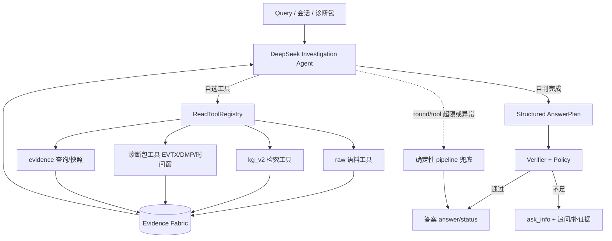

# 读侧：以 DeepSeek 为核心的 Agentic Agent 设计方案

> 状态：设计提案（未实施）；更新时间：2026-08-05
> 范围：把当前"确定性主链 + 旁路 Agent"的读侧架构，演进为"DeepSeek Agent 主导调查 + 确定性兜底验证"的 Agentic 架构。
> 目标：在不突破安全边界（只读、不裁决、不执行设备动作）的前提下，让读侧像 Copilot/Codex 一样具备模型驱动的灵活性，同时保留可审计、可回退、可校验的确定性底座。

---

## 1. 背景与问题陈述

### 1.1 当前读侧管线（现状）

```text
冻结基线：Query → SAG_v2 → KG_v2 runtime → Evidence Pack → Composer   ← 主链（确定性）
独立旁路：Query → Codex/DeepSeek Agent → CorpusReadTools → verifier    ← 旁路（模型驱动）
v3 shadow：冻结基线 + KG/SAG + raw + Incident → Evidence Fabric → Planner → Policy → Verifier
v4 调查 ：InvestigationState → 行动计划 → Policy → Verifier           ← 增量调查运行时
```

- 主链是**确定性 pipeline**：`DebugAgentSystem.start → SAG_v2 → KG_v2 → Composer`，步骤顺序写死。
- Agent 旁路已有：`CodexResponsesPlanRunner`（Responses API）、`DeepSeekChatAgentRunner`（Chat Completions，写好了但**未接入 CLI/配置**）、`CodexInvestigationPlanner`（v4）。
- 证据基础设施已齐备：`EvidenceFabric`（统一证据图）、`ReadToolRegistry`（只读工具注册表）、`InvestigationVerifier`/`InvestigationPolicy`（本地验证门禁）、`IncidentEvidenceRuntime`（诊断包解析）。

### 1.2 与 Copilot/Codex/Cursor 的实际差距

| 维度 | 当前读侧 | Copilot/Codex/Cursor | 差距 |
|---|---|---|---|
| 决策主体 | 确定性代码（主链） | 模型每轮自选工具/顺序 | **角色颠倒** |
| 工具覆盖 | 旁路只有 `CorpusReadTools`（3 个）；v4 的 `ReadToolRegistry` 只被 Codex 用 | 工具多、描述细、可组合 | 工具没全接到模型 |
| 迭代闭环 | 一次跑完 | 改→验证→反馈→再改 | 无 |
| 上下文管理 | 全量快照 | 摘要/裁剪/滚动 | 无 |
| 失败回退 | v4 有 fallback | 有 | 已具备 |
| 多 agent | 无 | 有 | 无（本期不做） |

**核心结论：当前是"确定性为主、模型为辅"；目标是把模型变为"调查主角"，确定性降为"兜底 + 校验"。**

### 1.3 为什么选 DeepSeek

- 项目已有 `DeepSeekChatCompletionsClient` + `DeepSeekChatAgentRunner`（`kg_raw_codex/deepseek_runner.py`），模型驱动 loop、工具转换、结构化输出提取、tool trace 均已实现。
- `.env.local` 已有 `DEEPSEEK_API_KEY` / `DEEPSEEK_W2_MODEL=deepseek-v4-pro`。
- DeepSeek 走 OpenAI 兼容 Chat Completions（无 `/v1/responses`），因此**用 function calling 而不是 Responses 工具协议**——这与 Codex 旁路天然并存，不互相干扰。

---

## 2. 目标与设计原则

### 2.1 目标

1. 读侧 Query 默认由 **DeepSeek Agent** 主导调查：自己选工具、决定搜索词、决定读哪些证据、判断何时停止。
2. 全部证据进入统一 `EvidenceFabric`，模型只能基于证据 ID 组织答案，不能杜撰来源。
3. 输出必须经过本地 `Verifier + Policy`；不满足充分性/安全门则降级为 `ask_info`，不冒充根因。
4. Agent 超限/失败时回退到确定性 pipeline，保证任何情况下都能给出可审计答案。
5. 与 Codex 旁路并存：同一 Query 可切换 `deepseek` / `codex` / `deterministic` 三种 runtime 做对比评测。

### 2.2 安全边界（不可突破）

- 只读：Agent 与工具均无写 canonical KG、无设备执行、无附件脚本执行。
- 不裁决：Agent 可以给出候选假设与置信度，但不能声称 `locked_root_cause` 或 `verified_fix`（由 verifier/policy 决定）。
- 来源闭合：答案中每个事实必须有 fabric 内证据 ID；否则 verifier 拒绝。
- 高成本/破坏性动作：标记 `blocked`，需人工授权。

---

## 3. 目标架构



### 3.1 关键组成

| 组件 | 职责 | 复用/新增 |
|---|---|---|
| `DeepSeekInvestigationPlanner` | 用 DeepSeek 跑 model-directed loop，输出 v4 AnswerPlan 契约 | 新增（仿 `CodexInvestigationPlanner`） |
| `DeepSeekChatAgentRunner` | Chat Completions function-calling loop | 复用现有，扩展工具注入 |
| `ReadToolRegistry` | 只读工具注册表（raw/kg/evidence） | 复用 |
| 诊断包工具集 | `parse_evtx_window` / `read_kernel_dump` / `read_log_window` | 新增（把 `IncidentEvidenceRuntime` 能力注册为工具） |
| `EvidenceFabric` | 统一证据图（ID、来源、关系） | 复用 |
| `InvestigationVerifier` / `InvestigationPolicy` | 本地门禁 | 复用 |
| `config/read_runtime_deepseek.yaml` | DeepSeek runtime 配置 | 新增 |

---

## 4. 详细设计

### 4.1 运行时：DeepSeekInvestigationPlanner

与 `CodexInvestigationPlanner` 同构，只换 runner：

```python
class DeepSeekInvestigationPlanner(InvestigationPlanner):
    name = "deepseek_investigation"

    def __init__(self, runner: DeepSeekChatAgentRunner):
        self.runner = runner

    def build(self, *, request, task, fabric, tool_registry, **kwargs):
        deterministic = super().build(task=task, **kwargs)
        try:
            payload = self.runner.run(
                request=request, task=task.task,
                fabric=fabric, tools=tool_registry,
            )
            model_plan = answer_plan_from_payload(task.task, payload)
            if not model_plan.sections:
                return deterministic
            # 复用 v4 的 sections/hypotheses/gaps 归一逻辑
            ...
        except Exception as exc:
            # fallback 到确定性
            return deterministic
```

关键点：
- runner 接收 `ReadToolRegistry`（不只 `CorpusReadTools`），模型可调用 raw/kg/evidence 全部工具。
- 输出解析用现有 `_extract_draft_json`（容错 DeepSeek 的 markdown fence / prose 前缀）。
- 任何 client/schema/loop 失败 → `return deterministic`（与 Codex planner 一致）。

### 4.2 工具层：诊断包工具（新增，本方案的核心增量）

把 `IncidentEvidenceRuntime` 的确定性能力注册为 4 个只读工具：

| 工具 | 入参 | 返回 | 说明 |
|---|---|---|---|
| `incident_parse_evtx_window` | zip 路径 / 成员名 / 时间窗(本地) | 命中的 EVTX 记录(provider/event_id/msg/timestamp) | 复用 `parse_evtx` + scope 对齐 |
| `incident_read_kernel_dump` | dmp 路径 | bugcheck code/name/params/OS | 复用 `parse_minidump_file` / `parse_kernel_dump_file` |
| `incident_read_log_window` | 日志路径 / 行号 / before / after | 行窗口文本 | 复用 `read_log_window` |
| `incident_query_events` | provider / event_id / 时间范围 | 事件列表 | 复用 incident events 索引 |

这样 DeepSeek 可以"按需深挖"（插网卡→查 9:26-9:30 事件→读 MEMORY.DMP 头），而不需要把全量诊断包塞进 prompt。

### 4.3 状态层：EvidenceFabric 摘要化

- 现有 `evidence_query` 全量返回 `limit 200`。加**摘要层**：默认返回 `summary[:500]` + 元数据，模型需要细节时再调 `evidence_get_full`（或 `raw_read_text`）。
- 目标：长会话（多轮工具）下控制上下文增长。

### 4.4 迭代闭环：Agent 输出 → 本地验证 → 回喂

这是与 Copilot 差距最大的点，分两级：

- **级 A（弱闭环，本期实现）**：DeepSeek 输出 AnswerPlan 后，本地 `InvestigationVerifier` 校验来源闭合、假设状态；**不通过就把校验错误回喂给模型，允许再修 1 次**（`max_refine_rounds=1`）。
- **级 B（强闭环，后续）**：Agent 给出假设后，本地自动执行**判别性验证**（如用 MEMORY.DMP 头校验假设 bugcheck、用日志时间窗校验"插网卡→蓝屏"时序），验证结果作为新证据入 fabric 并回喂。验证不通过 → Agent 修订假设。

### 4.5 上下文管理

- 系统 prompt 中明确收敛规则（参照现有 `DeepSeekChatAgentRunner` 的收敛规则）：优先精确搜索、命中即读、证据足够即停、最多 N 次工具。
- fabric 摘要 + `max_tool_rounds`（默认 12）+ `max_tool_calls`（默认 40）。

### 4.6 安全边界（代码层面强制）

- `ReadToolRegistry` 所有工具 `capability.read_only=True`，无 side effect。
- 诊断包工具只读文件，不执行附件、不写 canonical KG。
- verifier 拒绝：无证据 ID 的 claim、`locked_root_cause`/`verified_fix` 的越权升级、答案中包含未在 fabric 的来源。

---

## 5. 数据流与生命周期

```text
1. Query + evidence_resources 进入 v4 runtime（shadow 或 active）
2. provider 阶段：
   - incident（诊断包解析）→ fabric
   - request_context → fabric
   - kg_sag / raw / baseline → fabric
3. DeepSeekInvestigationPlanner.build：
   a. 确定性计划先算好（兜底就绪）
   b. DeepSeek loop：读 INITIAL_EVIDENCE → 自选工具 → 结果回喂 → 自判完成
   c. 输出结构化 AnswerPlan（sections/hypotheses/gaps/next_tests）
4. Policy 决定状态（answerable/diagnosable/executable）
5. Verifier 校验来源闭合与安全边界（失败可回喂 1 次）
6. 输出 answer/status；Agent 异常则返回确定性计划
```

---

## 6. 分阶段落地计划

### Phase 1：最小验证（目标：证明 DeepSeek 能"当主角"）
- 让 `DeepSeekChatAgentRunner` 接入 `ReadToolRegistry`（替换写死的 `CorpusReadTools`）。
- 新增 `DeepSeekInvestigationPlanner`，接入 `read_runtime_v4` 的 `planner` 选项。
- 新增 `config/read_runtime_deepseek.yaml`（model=deepseek-v4-pro，planner=deepseek_investigation）。
- 用蓝屏 query 跑一次：验证 DeepSeek 能否独立发现双终止码 / 网卡线索 / MEMORY.DMP=0x4E。

**验收**：Agent 的 proposed_answer 中至少出现 0x000000EF、0x4E、网卡事件、MEMORY.DMP 头解析 4 项中的 3 项；verifier 通过。

### Phase 2：诊断包工具 + 迭代闭环
- 注册 4 个诊断包工具（4.2）。
- fabric 摘要层（4.3）。
- 级 A 弱闭环：verifier 失败回喂 1 次（4.4）。

**验收**：Agent 能按需深挖 MEMORY.DMP / EVTX 时间窗；verifier 错误能触发 1 次修订。

### Phase 3：角色反转 + 评测门禁
- 默认入口从"冻结 pipeline"切到 DeepSeek agent（shadow 先行）。
- 复用现有分层测试集（`docs/archive/read-side/20260727/KG_v2读侧分层测试集.md`、benchmark）做三 runtime 对比：`deepseek` vs `codex` vs `deterministic`。
- 达到发布指标前保持 shadow；满足后再 `--active` 逐场景接管。

**验收**：对比报告显示 DeepSeek 在 incident 类 query 上的关键证据召回不低于 Codex；无回归。

### Phase 4（后续，可选）：强闭环与多 agent
- 级 B 强闭环（自动判别性验证回喂）。
- 多 agent 编排（调查 / 验证分离）。

---

## 7. 评测与门禁

- **结构门禁**：AnswerPlan 契约字段齐全、来源闭合、状态合法。
- **安全门禁**：无越权升级、无未授权动作、无附件执行。
- **质量对比**：同 Query 下 `deepseek` / `codex` / `deterministic` 三路输出对比（关键证据召回、假设质量、噪声、耗时、token 成本）。
- **回归**：现有 42 个单元测试 + 读侧分层测试集全部通过。
- **发布条件**：明确声明的门禁通过后才允许 `active` 接管；否则保持 shadow。

---

## 8. 风险与取舍

| 风险 | 缓解 |
|---|---|
| DeepSeek 结构化输出不稳定（fence/prose 前缀） | 复用 `_extract_draft_json` 容错 + verifier 拒绝不合法输出 |
| 上下文增长导致成本/质量下降 | fabric 摘要、收敛规则、round/call 上限 |
| Agent 幻觉（杜撰证据/根因） | 来源闭合 verifier + 不越权升级 + shadow 先行 |
| 角色反转后确定性兜底被绕过 | fallback 兜底 + `fail_open_to_v3` 语义保留 |
| 与 Codex 旁路并存造成双模型成本 | 默认单一 runtime，其它用于对比评测 |

---

## 9. 与现有组件的复用关系

| 现有组件 | 复用方式 |
|---|---|
| `DeepSeekChatCompletionsClient` / `DeepSeekChatAgentRunner` | 复用，扩展工具注入 |
| `ReadToolRegistry` | 复用，直接注入 |
| `EvidenceFabric` | 复用 |
| `InvestigationVerifier` / `InvestigationPolicy` | 复用 |
| `IncidentEvidenceRuntime` | 复用，封装为工具 |
| `CodexInvestigationPlanner` | 作为模板，同构实现 DeepSeek 版 |
| `_extract_draft_json` / `_to_chat_completions_tools` | 复用 |
| 冻结主链 / v3 / v4 | 保留，作为兜底与对比基线 |

---

## 10. 本次蓝屏案例的预期效果对照

| 能力 | 当前（确定性主链） | 目标（DeepSeek agent） |
|---|---|---|
| 双终止码识别 | ✗（只对齐 0xEF） | ✓（0xEF + 0x4E + MEMORY.DMP） |
| 网卡事件关联 | 弱（排前但不解释） | ✓（主动查 NDIS/e1rexpress 时序） |
| 深挖转储 | ✗（不主动） | ✓（调 `incident_read_kernel_dump`） |
| 追问/判别 | 模板化 | ✓（模型自判证据缺口） |
| 兜底 | 无（失败即答偏） | ✓（确定性 pipeline 兜底） |

---

## 11. 待确认事项

1. DeepSeek 用 `deepseek-v4-pro` 还是 `deepseek-v4-flash`（成本/质量取舍）。
2. 默认入口角色反转的时机：先 shadow 对比，还是直接 `active`（建议先 shadow）。
3. 是否需要把诊断包工具做成 `IncidentProvider` 扩展还是独立工具集（建议独立工具集，避免污染现有 provider 契约）。
4. 评测用现有分层测试集还是为 incident 场景新增一组建模（建议两者都跑）。
